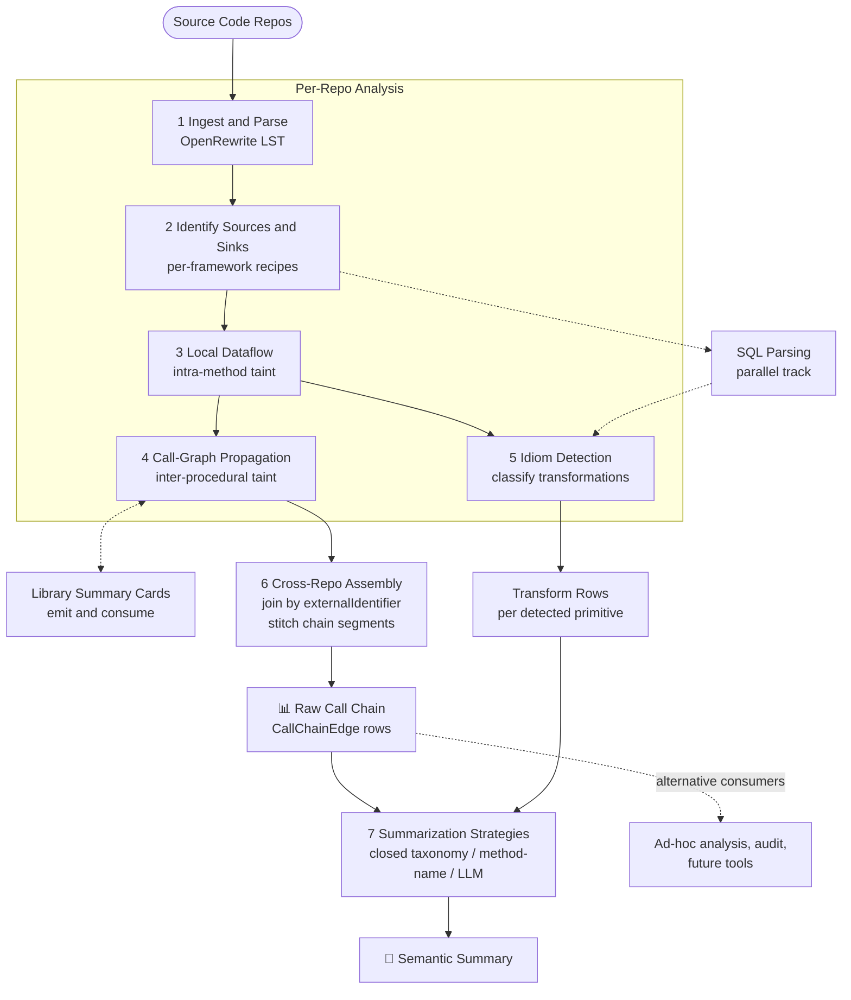

# Design: Cross-Repo Data Lineage via OpenRewrite

## Goal

Produce two complementary outputs describing how data flows through and across repositories:

1. The **raw call chain** from each source to each sink — every method on the path, with the dataflow edges through them — emitted as structured, queryable data.
2. A **semantic summary** built on top of the chain that names what's happening in vocabulary an engineer or analyst can read at a glance:

   > Pulled from the `orders` table, joined with the customer service API, aggregated by region, published to the `revenue.regional` Kafka topic.

Both are first-class deliverables. The chain stands on its own as a queryable artifact (for navigation, audit, debugging, ad-hoc analysis), *and* it enables trying different summarization strategies — closed taxonomy, LLM-based, future approaches — against the same underlying data without re-running the upstream analysis.

**Non-goal (for now):** tracking *novel* information that originates inside an application (clocks, RNGs, literals, env vars, computed-from-novel values). The model has a place for it but it's out of scope for the initial work.

## Conceptual model

Every running service is treated as a directed graph of `Source → Transform* → Sink` nodes over three primitives:

- **Source** — any point where data of external provenance enters the process: controller method params, message listener payloads, JDBC result rows, HTTP client response bodies, file/blob reads, cache hits.
- **Sink** — any point where data leaves the process: HTTP request bodies, controller responses, message producer payloads, JDBC/JPA writes, cache writes.
- **Transform** — any code that consumes one or more source-tainted values and produces a new value. Transforms are usually not annotated; they're discovered by *dataflow between* known sources and known sinks.

The graph itself — its nodes and edges walked from source to sink — is the **raw call chain** output. The **semantic summary** sits on top of the chain, classifying regions of it into a small named vocabulary of transformations. The two outputs are deliberately decoupled: chain extraction has no knowledge of transform kinds; summarization consumes the chain as input. This lets summarization strategies evolve independently of the analysis that produces the chain.

## Pipeline overview



A few things the diagram makes explicit:

- **Two output streams.** The raw chain (📊) and the semantic summary (📝) are produced by distinct stages. The chain falls out of cross-repo assembly; the summary is composed by a downstream strategy that consumes the chain plus transform rows.
- **Per-repo analysis is mostly linear, with one branch.** Once local dataflow is done, call-graph propagation and idiom detection can run independently — propagation feeds chain output, idiom detection feeds transform rows.
- **SQL is a parallel track.** It hangs off source/sink identification (since it triggers on SQL-shaped source/sink methods) and feeds idiom detection (since SQL gives project/filter/join/aggregate in their native vocabulary).
- **Library summary cards are bidirectional with call-graph propagation.** A repo *emits* summaries for its own public methods and *consumes* summaries at call sites into its dependencies.
- **The chain is queryable on its own.** The dotted "alternative consumers" arrow shows that ad-hoc analysis, audit tooling, or future summarization strategies can plug into the chain without going through the default summarization pipeline.

## Transformation taxonomy

A starter set, relational-algebra-flavored on purpose — most application code converges to these operations even when written imperatively.

| Kind | Detection signal |
|---|---|
| **Project** | Constructing a new type from a subset of another type's fields; `stream().map(x -> new Y(x.a, x.b))`; SQL `SELECT` clauses. |
| **Filter** | `stream().filter`; `if` guards before sinks; SQL `WHERE`. |
| **Join / Enrich** | Two source-tainted values converging on the same expression (constructor, builder, `Map.put`). The dataflow framework hands convergence points back directly. |
| **Lookup / Decorate** | Source A's fields used as keys to query source B inside a loop/stream; the result of B flows further downstream. |
| **Aggregate / Summarize** | `Collectors.groupingBy`, `reduce`, accumulator loops; SQL `GROUP BY` + aggregates. |
| **Derive / Compute** | Arithmetic, formatting, or formula over tainted values. |
| **Reshape** | Pure format conversion (JSON↔POJO↔Avro). Usually display noise; flag and suppress. |

The taxonomy is **closed** initially. `unclassified` is a valid output. New entries are added only when `unclassified` clusters into recognizable patterns. Resist sprawl.

## The shape of the outputs

### Raw call chain

For each source→sink path, structured rows describing every method on the path and the dataflow edges through them. Conceptually a slice of the call graph intersected with the taint graph. Queryable as data — see schema below. Useful on its own for:

- Navigation and audit ("which methods are on the path from this Kafka topic to that DB write?").
- Feeding alternative summarization strategies without re-running analysis.
- Debugging false positives/negatives in the semantic layer.

### Semantic summary

The human-readable view consumers will typically want:

> **Source:** query `orders` table (DB1), project `customer_id, total`. → **Lookup:** for each row, `GET /customers/{id}` (Customer Service). → **Join:** combine order + customer record. → **Aggregate:** `groupingBy(region, sum(total))`. → **Sink:** Kafka topic `revenue.regional`.

This falls out of the taxonomy when the idiom detectors fire along the path. The chain is the backbone the summary attaches to.

## Output schemas

### `DataFlowNode` (source/sink)

```
{
  kind,                // SOURCE | SINK
  framework,           // spring-mvc | kafka-consumer | jdbc | ...
  locator,             // repo + file + method + expression
  externalIdentifier,  // URL path, topic name, table name, queue name
  payloadType,         // FQN of the in/out Java type
  payloadSchemaRef     // optional — pointer to a richer schema if known
}
```

`externalIdentifier` is what enables cross-repo joining: an HTTP-out `POST /orders` in repo A matches `@PostMapping("/orders")` in repo B; a Kafka producer to `payments.v1` matches any consumer of that topic.

### `CallChainEdge` (raw chain output)

```
{
  fromMethod,          // FQN
  toMethod,            // FQN
  callSite,            // repo + file + line + expression
  taintedArgPositions, // which parameter positions carry tainted values
  taintedReturn,       // whether the return value is tainted
  sourceRefs,          // sources contributing taint to this edge
  sinkRefs             // sinks reachable downstream from this edge
}
```

A path from source to sink is an ordered sequence of these edges. The full chain output is the set of all edges along source-reachable, sink-reachable paths; consumers query/filter to extract specific paths. Locations on transform rows (below) reference the same `callSite` coordinates, so transforms and chain edges join cleanly.

### Transform row (semantic summary)

```
{
  transformKind,       // PROJECT | FILTER | JOIN | LOOKUP | AGGREGATE | DERIVE | RESHAPE | UNCLASSIFIED
  location,            // repo + file + method + expression (joins to CallChainEdge.callSite)
  inputs: [sourceRefs],// upstream tainted values
  output,              // type/schema where determinable
  evidence,            // LST snippet used for the match
  importance           // for display thresholding
}
```

`importance` lets the rendering layer pick salient transforms only — joins/aggregates/lookups always salient; reshapes rarely.

## SQL as a special lever

When a source, sink, or transform is a SQL statement, parse it as SQL rather than inferring transforms from imperative code. SQL gives:

- Project / filter / join / aggregate in their native vocabulary.
- Real column and table names that make cross-repo joins richer.
- Substantially higher confidence than imperative inference.

SQL handling runs as its own track in parallel to the imperative idiom detectors.

## Cross-repo and shared-library handling

Shared libraries are where most real source/sink/transform logic lives in mature orgs. Pure repo-local analysis breaks here.

The approach is **modular analysis with library summaries**: analyze each repo once, emit a structured summary card per public method, and substitute the summary at call sites in dependent repos. This is the procedure-summary pattern from classical static analysis.

A library summary is keyed by `(library-coordinates, fully-qualified-method, version)` and uses the same `DataFlowNode` schema, with an additional field on transforms:

```
{
  ...DataFlowNode fields...,
  hiddenSources: [...],  // sources the method reaches internally
  hiddenSinks:   [...]   // sinks the method reaches internally
}
```

`hiddenSources`/`hiddenSinks` is what prevents systematic under-reporting when a library reaches an additional data store the application can't see.

### Three sub-cases of library behavior

1. **Library wraps a source** — e.g. `OrderClient.fetchOrders()` internally does JDBC. Summary: source of kind JDBC, table=`orders`. The application call is indistinguishable from inlining the query.
2. **Library wraps a sink** — e.g. `EventPublisher.publish(event)` internally calls Kafka. Summary: sink of kind Kafka, topic=X. A tainted value flowing in reaches a sink.
3. **Library is itself a transform with hidden sources** — e.g. `OrderEnricher.enrich(orders)` joins your input with a second DB internally. Without the summary the application looks like one-source-in / one-output-out. `hiddenSources` exposes the additional contributor.

### Tiered strategy by library ownership

- **Owned and ingested into Moderne** — full summary generation by running the same recipes against the library repo. Gold path. Call-graph stitching happens at org level: the library's analyzed subgraph plugs in at the application's call site.
- **Not owned but a known framework** (Spring Data, Kafka clients, JDBC, JAX-RS, Feign, gRPC stubs) — curated hand-written summaries shipped as a recipe pack. This is the pattern taint analyzers like CodeQL use: a catalog of "known library sources/sinks" because there's no alternative. Most existing inventory recipes already encode this knowledge implicitly; the work is normalizing their output to the summary schema.
- **Long-tail third-party** — opaque, heuristic only: method name patterns (`save`/`find`/`publish`/`send`), parameter/return types, package conventions. Mark these summaries low-confidence so the display layer can flag them.

### Library-side annotations (accelerator)

For owned libraries, let authors declare semantics directly on the public API:

```java
@DataSource(kind = JDBC, table = "orders")
List<Order> fetchOrders();

@DataSink(kind = KAFKA, topic = "orders.v1")
void publish(OrderEvent e);

@DataTransform(kinds = {JOIN, AGGREGATE}, hiddenSources = {"customers-db"})
EnrichedOrder enrich(Order o);
```

Summary extraction becomes annotation reading rather than re-running analysis. Recipes remain the source of truth; annotations short-circuit the common case and document the contract — also a useful migration carrot.

### Framework-generated code

Spring Data repositories, `@FeignClient` interfaces, gRPC stubs, MapStruct mappers — none have method bodies to analyze; the framework supplies the semantics. Each needs a framework-specific summary generator that synthesizes a summary card from the interface, its annotations, and known framework conventions. The existing inventory recipes already cover most of this terrain; they need adaptation to emit summary cards rather than raw findings.

### Cross-repo graph assembly

After every repo emits its summaries and its local dataflow rows, the cross-repo graph is built in the data layer:

1. A call to `library.foo()` in an application's local dataflow resolves to the summary keyed by `(coordinates, foo, version)`.
2. Pinned to the dependency version actually consumed — `v2.fetchOrders` may hit a different table than `v1`.
3. Source/sink nodes connect across repos by `externalIdentifier`: HTTP-out to HTTP-in, producer topic to consumer topic, write to read against the same table.

## Summarization strategies

The semantic summary is one strategy applied to the chain; others can coexist. All consume the same `CallChainEdge` + transform rows as input, so they're swappable without re-running analysis.

For slices where no idiom matches cleanly:

1. **Method-name signal** — methods named `enrichOrderWithCustomer` or `summarizeByRegion` are already labeled by their author. Surface the name when no idiom matches; cheap and surprisingly informative at scale.
2. **LLM as last resort** — for `unclassified` slices (or for whole-path narration), feed the relevant chain edges plus in/out type signatures to a model and ask it to *pick from the taxonomy* (`aggregate`, `derive`, `unclear`). Constrained vocabulary, not freeform prose, so outputs stay composable.

Other strategies (e.g. SQL-only summarization, schema-diff–driven summarization) can be added later without disturbing the upstream pipeline.

## Phased plan

**Phase 1 — Schemas.** Lock down `DataFlowNode`, transform row, and library summary card as serializable records. Everything downstream depends on this being stable.

**Phase 2 — Source/sink catalog.** One recipe per framework-primitive pair (HTTP-in, HTTP-out, messaging-in/out, persistence-in/out, file/blob, cache). Most exist as "find usages of X" recipes already; the work is normalizing output to the schema.

**Phase 3 — Intra-procedural dataflow.** Use `rewrite-analysis`'s `Dataflow`/`Taint` framework (same one behind `FindFlowBetween`) to connect sources to sinks within a single method. Local transform chains fall out for free.

**Phase 4 — Idiom detection.** One recipe (or family) per taxonomy entry, walking dataflow slices and emitting transform rows. Start with **join detection** — most informative primitive, exercises the dataflow framework's convergence-point capability.

**Phase 5 — Inter-procedural call chain.** Use Moderne's call graph to propagate taint across method boundaries within a repo. Emit `CallChainEdge` rows along source-reachable, sink-reachable paths. **This is the raw call chain output — a first-class deliverable on its own, independent of any semantic interpretation.** Inventory recipes pre-mark methods containing sources/sinks so propagation traverses only the relevant slice.

**Phase 6 — Library summaries.** Add summary-card emission to Phases 2 and 4. Build the curated catalog of known-framework summaries. Add annotation support for owned libraries.

**Phase 7 — Cross-repo joins.** Data-layer joins on `externalIdentifier` and on `(library-coords, method, version)`. Cross-repo chain assembly happens here: stitch `CallChainEdge` sequences across repo boundaries via library summaries.

**Phase 8 — SQL track.** Parallel to Phases 2–4. SQL parsing for sources, sinks, and embedded SQL transforms.

**Phase 9 — Summarization strategies.** Compose detected primitives along the source→sink path into the human-readable summary, gated by `importance` thresholding. Multiple strategies are pluggable, each consuming the chain + transform rows: (a) the closed-taxonomy renderer, (b) LLM-based summarization for `unclassified` slices or whole-path narration, (c) future strategies. The chain is the stable input contract; strategies evolve independently.

## Open design decisions

- **Granularity of payload tracking.** Call-level (this source reached this sink, payloads opaque) versus value-level (this field flowed to that field). Start call-level, leave hooks for field-level. Value-level is dramatically more useful and dramatically more expensive.
- **Importance scoring.** Heuristic per-kind for v1 (joins/aggregates/lookups always salient; reshapes rarely). Revisit if real summaries come out too verbose or too lossy.
- **Call-graph fidelity.** Confirm whether the call graph provides parameter-position-aware edges or just method→method. Precise taint propagation and the `taintedArgPositions` field on `CallChainEdge` need the former; if only the latter is available, the call graph may need enrichment.
- **Chain identity and stability.** How a logical source→sink chain stays identifiable across re-runs as code changes underneath. Likely: a hash over (source locator, sink locator, ordered method FQNs), plus a separate "fuzzy" key tolerating intermediate-method renames. Matters for any consumer that wants to track summaries diff-over-time.
- **Annotation API ownership.** Whether `@DataSource` / `@DataSink` / `@DataTransform` ship from this repo, a separate companion module, or a downstream artifact. Affects how easily owned libraries can opt in.
- **Versioning of summaries.** How to handle a dependent repo on an older version of a library when only the latest has analyzed summaries. Probably: regenerate summaries per published version and key on the consumed version.
